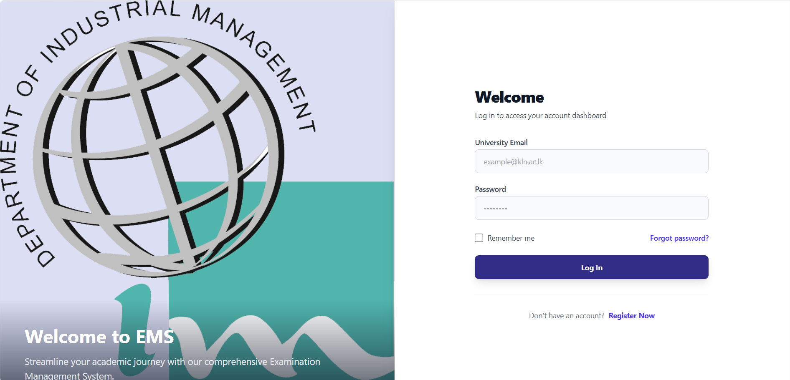
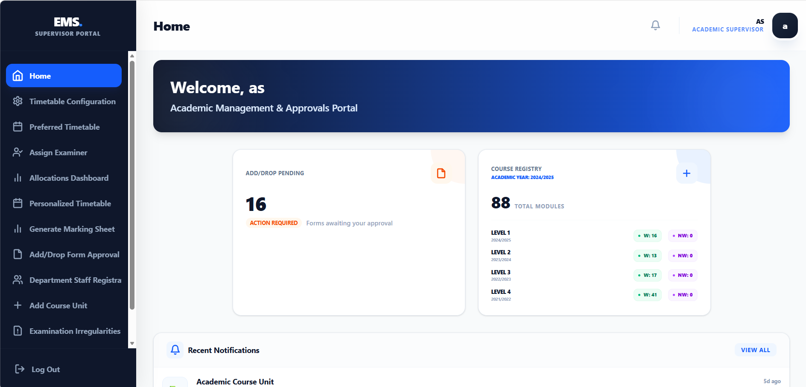
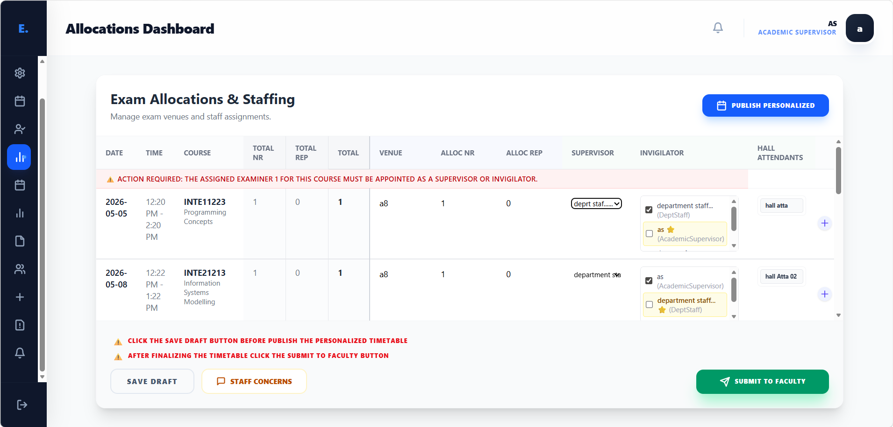
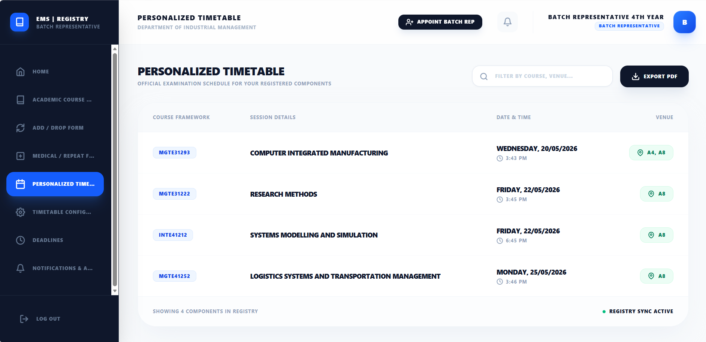

# Examination Management System (EMS)


## 📌 Project Overview

The **Examination Management System (EMS)** is a robust, full-stack web application designed to streamline the complex processes of academic examination scheduling, allocation, and communication. It provides a centralized platform for administrators, faculty, and students to manage timetables, notifications, and academic records efficiently.

---

## 🚀 Key Features

### 👥 User Roles & Dashboards
The system features a tailored experience for 7 distinct user roles:
- **Academic Supervisor & Dean**: High-level oversight, approval workflows, and system configuration.
- **Faculty & Department Staff**: Timetable generation, hall allocations, and staff management.
- **Hall Attendants**: View assigned duties and schedules.
- **Students**: Personalized timetables, deadline notifications, and profile management.
- **Batch Representatives**: Coordination between students and department staff.

### 📅 Examination Scheduling
- Automated and manual allocation of examination halls and timeslots.
- Conflict detection (overlapping exams).
- Publication workflow for draft and final timetables.

### 🔔 Communication & Notifications
- **Automated Emails**: Notifications via Nodemailer for account approvals and timetable publications.
- **Internal Alerts**: Real-time dashboard notifications for deadlines and updates.
- **Document Export**: PDF generation for personalized timetables and reports using `jspdf`.

---

## 🛠️ Tech Stack

- **Frontend**: [React.js](https://reactjs.org/) (Vite), [Tailwind CSS](https://tailwindcss.com/) for modern, responsive UI.
- **Backend**: [Node.js](https://nodejs.org/), [Express.js](https://expressjs.com/).
- **Database**: [MySQL](https://www.mysql.com/) managed via [Sequelize ORM](https://sequelize.org/).
- **Authentication**: Secure JWT-based authentication and Bcrypt password hashing.
- **Others**: `node-cron` for scheduled tasks, `Multer` for file uploads.

---

## 📸 Screenshots Gallery

> [!TIP]
> **To add your own screenshots:**
> 1. Take a screenshot of the relevant page in your browser.
> 2. Save it to the `docs/screenshots/` directory.
> 3. Name your file exactly as suggested (e.g., `dashboard.png`) or update the links below.

| Feature | Screenshot |
|---------|------------|
| **Login Page** |  |
| **Admin Dashboard** |  |
| **Timetable Allocation** |  |
| **Student Timetable** |  |
| **Email Notifications** |  |

---

## ⚙️ Installation & Setup

### Prerequisites
- Node.js (v16+)
- MySQL Server

### 1. Database Setup
- Create a MySQL database named `ems_db` (or as configured in `.env`).
- Import the provided schema scripts from the `/database` folder if available.

### 2. Backend Configuration
```bash
cd server
npm install
# Create a .env file based on .env.example
npm run dev
```

### 3. Frontend Configuration
```bash
cd client
npm install
npm run dev
```

---

## 📄 License

Distributed under the MIT License. See `LICENSE` for more information.
